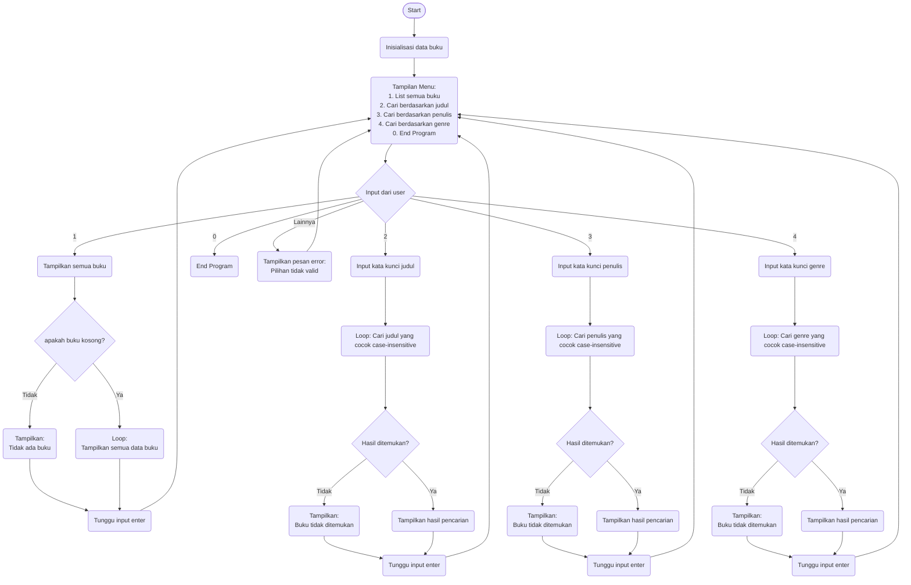

JUDUL UTAMA: 
BookHunt

PENDAHULUAN
Book Hunt merupakan aplikasi untuk pencarian buku berbasis terminal yang memungkinkan pengguna untuk mengelola dan mencari koleksi buku dengan mudah. Program ini case-insensitive dan memiliki fitur untuk melihat daftar lengkap buku, serta melakukan pencarian buku berdasarkan tiga kategori: judul, penulis, dan genre. Data buku mencakup informasi judul, nama penulis, dan genre, dengan koleksi yang beragam mulai dari fiksi klasik, fantasi, hingga pengembangan diri. 

FITUR UTAMA
(1) Daftar Buku
    Menampilkan semua buku terdata dengan format: judul, penulis, dan genre.
(2)Pencarian Berdasarkan Judul
    Setelah input kata kunci judul buku, akan menampilkan semua buku yang judulnya mengandung kata kunci tersebut. (Case-
    insensitive)
(3) Pencarian Berdasarkan Penulis
    Setelah input kata kunci nama penulis, akan menampilkan semua buku yang nama penulisnya mengandung kata kunci tersebut
    (Case-insensitive)
(4) Pencarian Berdasarkan Genre
    Setelah input dari pengguna untuk kata kunci genre, akan menampilkan semua buku yang genrenya mengandung kata kunci
    tersebut. (Case-insensitive)

Panduan Intalasi
1)	Buka Visual Code Studio
2)	Pada Menu Utama Klik ‘Clone Git Rpository’
3)	Masukkan Link Repository (https://github.com/p4seppp/dijang)
4)	Buat Folder untuk Clone 

Panduan Menjalankan
1)	Buka file dan Run 
2)	Navigasi Menu Setelah Run (Pilih No 0-4 untuk mengakses fitur pencarian)
No 1: Melihat daftar semua buku 
No 2: Mencari buku berdasarkan judul
No 3: Mencari buku berdasarkan penulis 
No 4: Mencari buku berdasarkan genre 
No 0: Keluar dari program

Contoh: Untuk mencari buku fantasi, pilih opsi 4 dan ketik "fantasi". Program akan menampilkan semua buku dengan genre Fantasi yang terdata.

Dokumen Teknis Flowchart:

Kontributor
| No | Nama Lengkap | NIM | Akun GitHub | Peran |
| ------------- | ------------- | ------------- | ------------- | ------------- |
| 1 | Joseph Adi Sanuri  | 250211060112  | [Content Cell](https://github.com/p4seppp)  | Project Maintainer  |
| 2 | Kezia Florezita  | 250211060094  | [Content Cell](https://github.com/dokjaakim)  | Contributor  |
| 3 | Gamaliel Calvyn Hizkia Kaligis  | 250211060111  | [Content Cell](https://github.com/gamlklgs)  | Contributor  |
